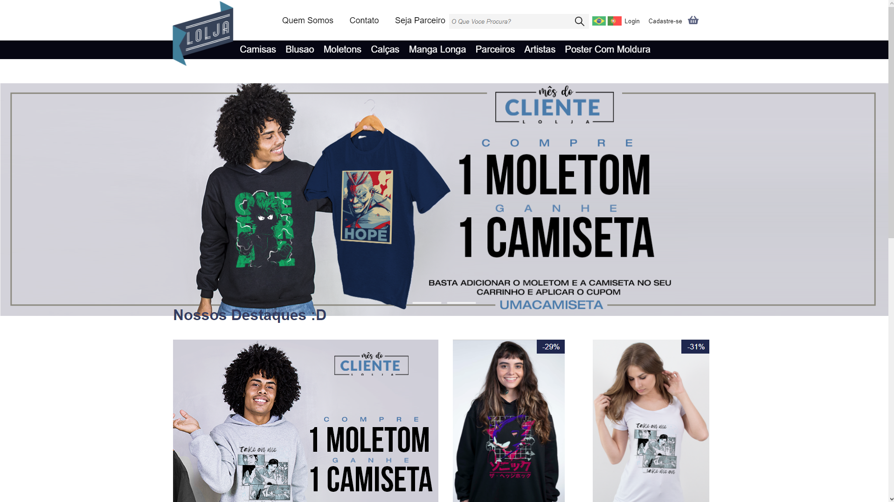

# Clone - LolJa
Um Projeto Desenvolvido Com O Intuito De Praticar O Uso De HTML E CSS, Para Isso Foi Feito Um Clone Do Site Da [Lolja](https://www.lolja.com.br/)

Na Imagem Acima Podemos Ver Um Slider Com Imagens De Produtos Em Promoção. Abaixo Temos Uma Lista De Produtos Em Destaque Com Seus Respectivos Preços. Por Fim, Temos Um Rodapé Com Links E Contatos.

